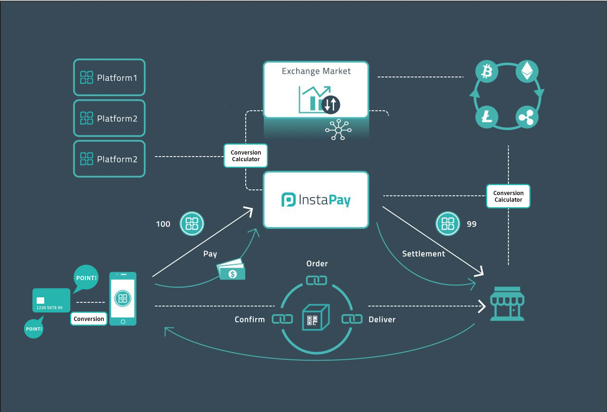

# ERC-20 instaCoin

[instacoin.website](https://instacoins.io)

INC, instaCoin is a decentralized global digital currency.

This repo contains Solidity smart contract code for ERC-20 implementation.

## Whitepaper

[Read here](https://instacoin.s3.ap-northeast-2.amazonaws.com/INSTACOIN_WhitePaper_v2.0_KR.pdf)

